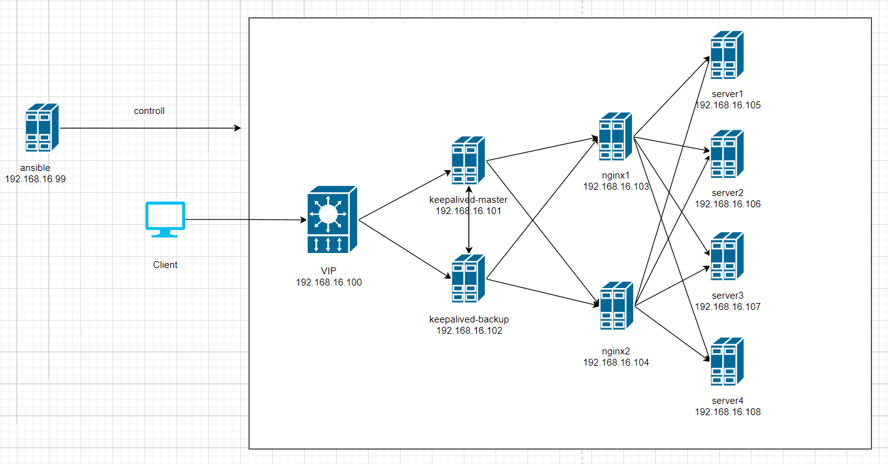

# 一、前期准备

- 环境准备

一台管理节点、两台keeplived节点、两台nginx主机、四台服务器主机。

```shell
192.168.16.99:	ansible
192.168.16.100:	VIP
192.168.16.101:	keepalived-master
192.168.16.102:	keepalived-backup
192.168.16.103:	nginx1
192.168.16.104: nginx2
192.168.16.105: server1
192.168.16.106: server2
192.168.16.107: server3
192.168.16.108: server4
```

- 拓扑图



# 二、部署ansible

- 安装ansible

```shell
[root@ansible ~]#  yum install epel-release.noarch -y
[root@ansible ~]# yum install -y ansible
```

- 免密登录

```shell
# 生成密钥对
[root@ansible ~]# ssh-keygen -P "" -t rsa
# 将公钥发送给需要被管理端，需要输入对方的免密
[root@ansible .ssh]# ssh-copy-id -i /root/.ssh/id_rsa.pub root@192.168.16.101
#同理将公钥发给其他主机
```

- 编写主机清单文件

```shell
[all_ip]
192.168.16.101
192.168.16.102
192.168.16.103
192.168.16.104
192.168.16.105
192.168.16.106
192.168.16.107
192.168.16.108
[keepalived_master]
192.168.16.101
[keepalived_backup]
192.168.16.102
[nginx]
192.168.16.103
192.168.16.104
```

- 为所有主机生成hosts解析文件

```shell
[root@ansible template]# vim /root/playbook/template/hosts.j2
127.0.0.1 localhost localhost.localdomain localhost4 localhost4.localdomain4
::1 localhost localhost.localdomain localhost6 localhost6.localdomain6


{{ hostvars[host].ansible_ens33.ipv4.address }} {{ hostvars[host].ansible_hostname }}


#编写剧本
[root@server1 playbook]# vim hosts.yml
- name: Config hosts file
  hosts: all_ip
  remote_user: root

  tasks:
  - name: copy hosts.j2 to group servers
    template:
      src: /root/playbook/template/hosts.j2
      dest: /etc/hosts
      
#执行剧本
[root@ansible playbook]# ansible-playbook hosts.yml
```

- 新建角色

```shell
[root@ansible yum.repos.d]# ansible-galaxy init /etc/ansible/roles/keepalived_master
- Role /etc/ansible/roles/keepalived_master was created successfully
[root@ansible yum.repos.d]# ansible-galaxy init /etc/ansible/roles/keepalived_backup
- Role /etc/ansible/roles/keepalived_backup was created successfully
[root@ansible yum.repos.d]# ansible-galaxy init /etc/ansible/roles/nginx
- Role /etc/ansible/roles/nginx was created successfully
```

# 三、使用keepalived配置LVS

- 在LVS的机器上安装keepalived

```shell
[root@ansible playbook]# vim /etc/ansible/roles/keepalived_master/tasks/main.yml
---
# tasks file for keepalived
- name: yum install keepalived
  yum:
    name: keepalived
    state: installed
- name: install ipvs
  yum:
    name: ipvsadm
    state: installed
- name: copy configuration to keepalived
  template:
    src: /root/playbook/keepalived_master.conf #从机为keepalived_backup.conf
    dest: /etc/keepalived/keepalived.conf
- name: start keepalived
  service:
    name: keepalived
    state: restarted
    enabled: yes
    
[root@ansible playbook]# vim keepalived_master.conf
global_defs { 
    # 路由id：当前安装keepalived的节点主机标识符，保证全局唯一 
    router_id keep_171 
} 

vrrp_instance VI_1 { 
    # 表示状态是MASTER主机还是备用机BACKUP 
    state MASTER 
    # 该实例绑定的网卡 
    interface ens33 
    # 保证主备节点一致即可 
    virtual_router_id 51 
    # 权重，master权重一般高于backup，如果有多个，那就是选举，谁的权重高，谁就当选 
    priority 100 
    # 主备之间同步检查时间间隔，单位秒 
    advert_int 2 
    # 认证权限密码，防止非法节点进入 
    authentication { 
        auth_type PASS 
        auth_pass 1111 
    } 
    # 虚拟出来的ip，可以有多个（vip） 
    virtual_ipaddress { 
        192.168.16.100
    }
}

#配置集群访问的ip+端口，端口和nginx保持一致
virtual_server 192.168.16.100 80{
    #健康检查的时间，单位：秒
    delay_loop 6
    #配置负载均衡的算法，默认的轮询
    lb_algo rr
    #设置LVS的模式 NAT|TUN|DR
    lb-kind DR
    #设置会话持久化的时间
    persistence_timeout 5
    #协议
    protocol TCP
    
    #配置负载均衡的真实服务器，也就是nginx节点的具体的ip地址
    real_server 192.168.16.103 80{
        #轮询权重配比
        weight 1
        #设置健康检查
        TCP_CHECK {
            #检查80端口
            connect_port 80
            #超时时间
            connect_timeout 2
            #重试次数
            nb_get_retry 2
            #重试间隔时间
            delay_before_retry 3
        }
    }
    real_server 192.168.16.104 80{
        weight 1
        TCP_CHECK {
            connect_port 80
            connect_timeout 2
            nb_get_retry 2
            delay_before_retry 3
        }
    }
}

[root@ansible playbook]# vim keepalived_master.yml
- name: install keepalived
  hosts: keepalived_master

  roles:
  - keepalived_master
#运行
[root@ansible playbook]# ansible-playbook keepalived_master.yml
```

**注意：**从机部署与主机类似。

# 四、部署nginx

- 安装nginx

```shell
[root@ansible playbook]# vim /etc/ansible/roles/nginx/tasks/main.yml
---
# tasks file for nginx
- name: yum install epel
  yum:
    name: epel-release.noarch
    state: present

- name: yum install nginx
  yum:
    name: nginx
    state: present

- name: nginx configuration
  template:
    src: /root/playbook/nginx.conf
    dest: /etc/nginx/conf.d/nginx.conf

- name: start nginx
  service:
    name: nginx
    state: restarted
    enabled: yes

[root@ansible playbook]# vim nginx.conf
user nginx;
worker_processes {{ ansible_processor_vcpus }};
error_log /var/log/nginx/error.log;
pid /var/run/nginx.pid;
events {
    worker_connections  1024;
}

http {
    log_format  main  '$remote_addr - $remote_user [$time_local] "$request" '
                      '$status $body_bytes_sent "$http_referer" '
                      '"$http_user_agent" "$http_x_forwarded_for"';

    access_log  /var/log/nginx/access.log  main;

    sendfile            on;
    tcp_nopush          on;
    tcp_nodelay         on;
    keepalive_timeout   65;
    types_hash_max_size 2048;

    include             /etc/nginx/mime.types;
    default_type        application/octet-stream;


    include /etc/nginx/conf.d/*.conf;

    upstream web {

        server 192.168.16.105:80 max_fails=3 fail_timeout=30s;
        server 192.168.16.106:80 max_fails=3 fail_timeout=30s;
        server 192.168.16.107:80 max_fails=3 fail_timeout=30s;
        server 192.168.16.108:80 max_fails=3 fail_timeout=30s;
    }

    server {

    listen       80 default_server;
    server_name  {{ ansible_hostname }};
    root         /usr/share/nginx/html;
    index index.html index.php;

         location / {
                proxy_pass http://web;
             }

         error_page 404 /404.html;

          }
}


[root@ansible playbook]# vim nginx.yml
- name: install nginx
  hosts: nginx

  roles:
  - nginx
  
#运行
[root@ansible playbook]# ansible-playbook nginx.yml
```

# 五、实现Keepalived+Lvs+Nginx高可用集群负载均衡

**最后只需要在四台客户机上安装nginx，然后修改html文件内容分别为server1、server2、server3、server4即可实现Keepalived+Lvs+Nginx高可用集群负载均衡。**

- 测试

```shell
[root@Ansible ~]# for i in {1..10};do curl 192.168.16.100;done
server1
server2
server3
server4
server1
server2
server3
server4
server1
server2
```

- 将keepalived_master节点关闭，VIP会漂移到keepalived_backup上，网站依然可以正常访问，实现了高可用。

```
[root@Ansible ~]# for i in {1..10};do curl 192.168.16.100;done
server1
server2
server3
server4
server1
server2
server3
server4
server1
server2
```

# 六、总结

- 健康检查和失败切换是keepalived的两大核心功能。所谓的健康检查，就是采用tcp三次握手， icmp请求，http请求，udp echo请求等方式对负载均衡器后面的实际的服务器(通常是承载真实业务的服务器)进行保活；而失败切换主要是应用于配置了主备模式的负载均衡器，利用VRRP维持主 备负载均衡器的心跳，当主负载均衡器出现问题时， 由备负载均衡器承载对应的业务，从而在最大限度上减少流量损失，并提供服务的稳定性。

- lvs基于四层负载均衡，工作效率较Nginx的七层负载更高，使用LVS搭建Nginx集群，可以提高性能。
- 四层负载均衡无法对信息处理，只能通过ip+端口的形式转发，所以需要七层负载进行数据的处理。
- Nginx可以接收请求并响应，LVS可以只接受不响应。


